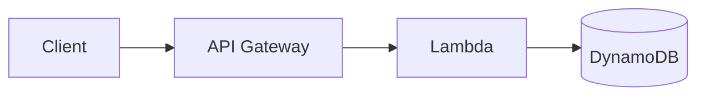
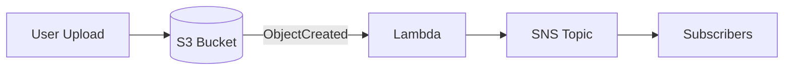
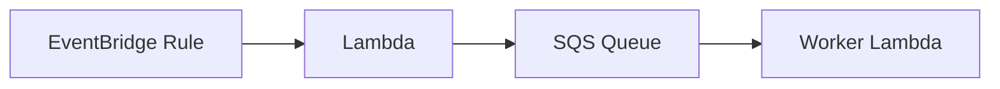
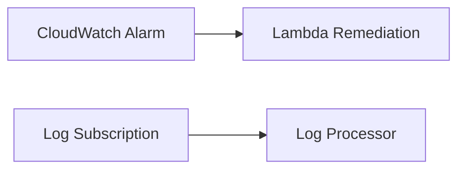
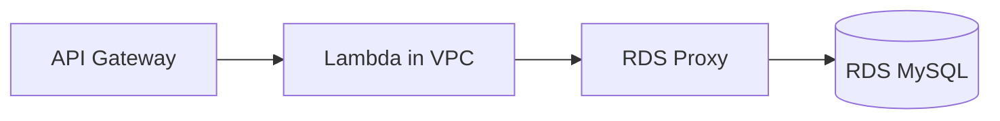
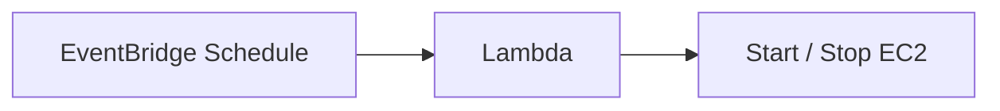
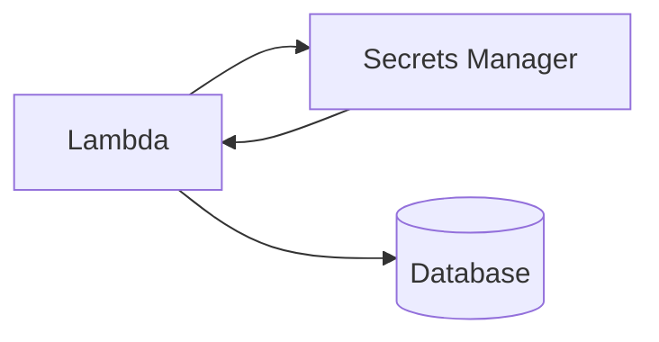
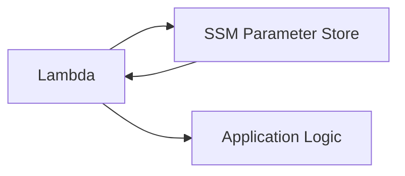
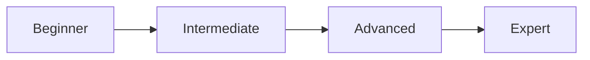

# AWS Fundamentals + Boto3

> **Learn AWS fundamentals through practical Python Boto3 examples deployable on AWS Lambda.**

Hands-on labs for IAM, Secrets Manager, Parameter Store, Lambda orchestration, and more. Each module includes production-quality Python code, IAM policies, deployment commands, and interview prep.

---

## Quick Start

```bash
cd aws-fundamentals-boto3
python -m venv .venv
.venv\Scripts\activate          # Windows
pip install -r requirements.txt
aws configure
```

See [docs/getting-started.md](./docs/getting-started.md) for full setup and deployment instructions.

---

## AWS Fundamentals

### Regions and Availability Zones

| Concept | Description |
|---------|-------------|
| **Region** | Geographic area (e.g., `us-east-1`). Most services are regional. |
| **Availability Zone (AZ)** | Isolated data center within a region. Deploy across multiple AZs for high availability. |
| **Local Zone / Wavelength** | Edge extensions for ultra-low latency |

Choose a region close to users and check service availability. IAM is global; S3, Lambda, and DynamoDB are regional.

### Networking (VPC)

| Concept | Description |
|---------|-------------|
| **VPC** | Virtual Private Cloud — your isolated network in AWS |
| **Subnet** | Segment of VPC IP range in one AZ (public or private) |
| **Route Table** | Rules directing traffic from subnets |
| **Internet Gateway (IGW)** | Allows public subnet resources to reach the internet |
| **NAT Gateway** | Lets private subnet resources initiate outbound internet access |
| **Security Group** | Stateful virtual firewall at instance/ENI level |
| **NACL** | Stateless subnet-level firewall (allow/deny rules) |

Lambda functions run in the AWS-managed VPC by default. Place Lambda in a **private subnet** with NAT when accessing RDS or internal resources.

### Identity (IAM)

| Concept | Description |
|---------|-------------|
| **Root account** | Full access — avoid for daily use |
| **IAM User** | Long-term human or app identity |
| **IAM Role** | Temporary credentials assumed by services (Lambda uses this) |
| **Policy** | JSON permissions document |
| **Least privilege** | Grant only the permissions required |

Lambda never needs hardcoded access keys — it assumes an **execution role** at runtime.

---

## AWS Architecture Patterns

Eight common serverless patterns used throughout this repository. Full diagrams: [diagrams/architecture-patterns.md](./diagrams/architecture-patterns.md).

### 1. API Gateway → Lambda → DynamoDB



REST API backed by serverless compute and NoSQL storage.

### 2. S3 → Lambda → SNS



Event-driven notifications on file upload.

### 3. EventBridge → Lambda → SQS



Decouple producers and consumers with durable queues.

### 4. CloudWatch → Lambda



Automated remediation and log processing.

### 5. Lambda → RDS



API access to relational databases via VPC Lambda.

### 6. Lambda → EC2



Cost optimization and automation for EC2 fleets.

### 7. Lambda → Secrets Manager



Secure credential retrieval without hardcoded passwords.

### 8. Lambda → Parameter Store



Runtime configuration without redeployment.

---

## Learning Path



| Level | Focus | Modules |
|-------|-------|---------|
| **Beginner** | AWS basics, IAM, permissions | IAM, Parameter Store |
| **Intermediate** | Lambda + Boto3, messaging, storage | S3, DynamoDB, SNS, SQS |
| **Advanced** | Event-driven architecture | EventBridge, CloudWatch, Secrets Manager |
| **Expert** | Serverless solutions architect | RDS, EC2, Lambda-to-Lambda, multi-service patterns |

### Recommended Order

1. [IAM](./lambda/iam/README.md) — understand roles and policies first
2. [Parameter Store](./lambda/parameterstore/README.md) — simple configuration
3. [Secrets Manager](./lambda/secretsmanager/README.md) — secure credentials
4. [Lambda-to-Lambda](./lambda/lambda-to-lambda/README.md) — orchestration patterns
5. S3, DynamoDB, SNS, SQS, EventBridge, CloudWatch, RDS, EC2 (sibling modules)

---

## Module Index

| Module | Description | Handlers |
|--------|-------------|----------|
| [IAM](./lambda/iam/README.md) | Roles, policies, trust relationships | `create_role`, `attach_policy`, `list_roles` |
| [Secrets Manager](./lambda/secretsmanager/README.md) | Encrypted secret storage and rotation | `create_secret`, `get_secret`, `update_secret`, `delete_secret` |
| [Parameter Store](./lambda/parameterstore/README.md) | Hierarchical configuration | `put_parameter`, `get_parameter`, `delete_parameter` |
| [Lambda-to-Lambda](./lambda/lambda-to-lambda/README.md) | Sync and async invocation | `invoke_lambda` |
| S3 | Object storage | `create_bucket`, `upload_file`, `list_objects`, `delete_object` |
| EC2 | Virtual machine lifecycle | `create_instance`, `stop/start/terminate`, `describe_instance` |
| DynamoDB | Serverless NoSQL | `create_table`, `put/get/update/delete_item`, `scan_items` |
| RDS | MySQL via Lambda | `create_database`, CRUD operations |
| SNS | Pub/sub messaging | `publish_message`, `subscribe_email`, `unsubscribe` |
| SQS | Queue processing | `send_message`, `receive_message`, `delete_message` |
| EventBridge | Event routing | `put_event`, `create_rule`, `attach_target` |
| CloudWatch | Observability | `put_metric`, `create_alarm`, `send_logs` |

---

## Code Standards

Every Python handler in this repository includes:

- Imports, constants, and environment variables
- Structured logging (`logging` module)
- `ClientError` exception handling
- `lambda_handler(event, context)` entry point
- `EXAMPLE_EVENT` for local testing
- `if __name__ == "__main__"` block

```python
import boto3
from botocore.exceptions import ClientError

def lambda_handler(event, context):
    try:
        # Boto3 API call
        return {"statusCode": 200, "body": json.dumps(result)}
    except ClientError as exc:
        return {"statusCode": 500, "body": json.dumps({"error": exc.response["Error"]["Message"]})}
```

---

## Repository Structure

```
aws-fundamentals-boto3/
├── README.md                 ← You are here
├── requirements.txt
├── docs/
│   └── getting-started.md
├── diagrams/
│   └── architecture-patterns.md
└── lambda/
    ├── iam/
    ├── secretsmanager/
    ├── parameterstore/
    ├── lambda-to-lambda/
    ├── s3/
    ├── ec2/
    ├── dynamodb/
    ├── rds/
    ├── sns/
    ├── sqs/
    ├── eventbridge/
    └── cloudwatch/
```

---

## Security Best Practices

- Use IAM roles — never embed access keys in code
- Apply least-privilege policies scoped to resource ARNs
- Encrypt secrets (Secrets Manager, SecureString parameters)
- Enable CloudTrail for audit logging
- Run cleanup steps after every lab
- Block public access on S3 buckets by default

---

## Cost Awareness

| Service | Typical Lab Cost |
|---------|------------------|
| IAM, Parameter Store (Standard) | Free |
| Lambda | Free tier: 1M requests/month |
| Secrets Manager | ~$0.40/secret/month |
| S3, DynamoDB, RDS, EC2 | May incur charges — always cleanup |

---

## Certification Alignment

| Exam | Relevant Topics |
|------|-----------------|
| **Cloud Practitioner** | Regions, IAM, S3, basic services |
| **Solutions Architect Associate** | VPC, event-driven patterns, security |
| **Developer Associate** | Lambda, Boto3, DynamoDB, SQS/SNS |

---

## External Resources

- [Boto3 Documentation](https://boto3.amazonaws.com/v1/documentation/api/latest/index.html)
- [AWS Lambda Developer Guide](https://docs.aws.amazon.com/lambda/latest/dg/welcome.html)
- [IAM Best Practices](https://docs.aws.amazon.com/IAM/latest/UserGuide/best-practices.html)

---

*Built for learners mastering AWS fundamentals with Python, Boto3, and AWS Lambda.*
