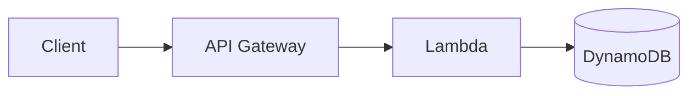
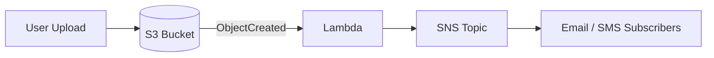
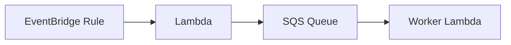
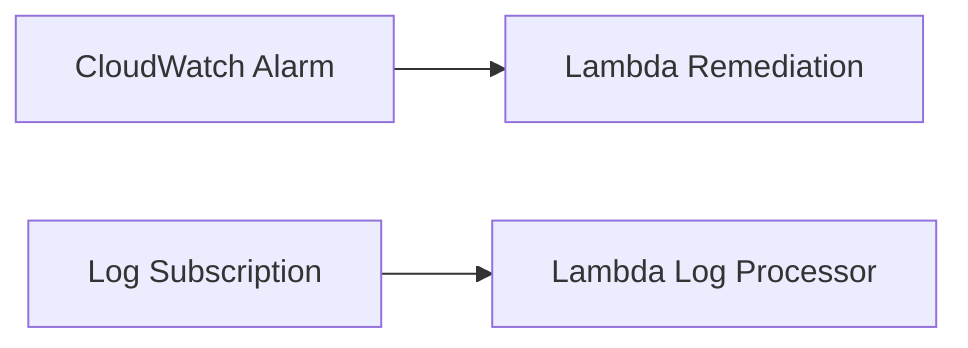
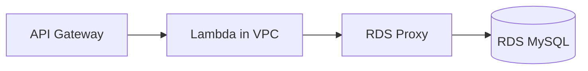
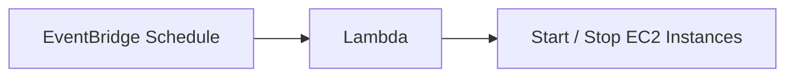
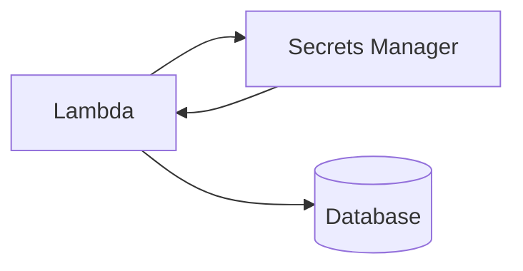
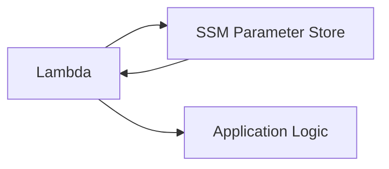

# Architecture Patterns

## 1. API Gateway → Lambda → DynamoDB

## 2. S3 → Lambda → SNS

## 3. EventBridge → Lambda → SQS

## 4. CloudWatch → Lambda

## 5. Lambda → RDS

## 6. Lambda → EC2

## 7. Lambda → Secrets Manager

## 8. Lambda → Parameter Store

