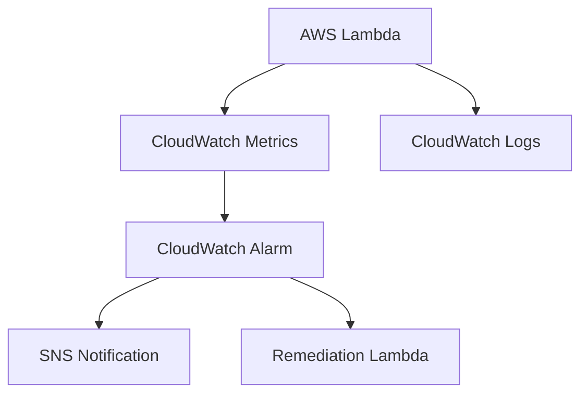

# Amazon CloudWatch + Boto3 + Lambda

> Observability with custom metrics, alarms, and log events.

## Architecture Diagram

```
Application / Lambda
        ↓
   CloudWatch (Metrics + Logs + Alarms)
        ↓
   Actions (SNS / Lambda remediation)
```



## What Is Amazon CloudWatch?

**Amazon CloudWatch** monitors AWS resources and applications. It collects **metrics**, stores **logs**, and triggers **alarms** when thresholds are breached.

| Concept | Description |
|---------|-------------|
| **Metric** | Time-ordered data point (CPU, custom counter, etc.) |
| **Namespace** | Groups related metrics (e.g. `Lab/Application`) |
| **Alarm** | Watches a metric and triggers action on breach |
| **Log group / stream** | Container for log events |
| **Dashboard** | Visual view of metrics (not covered in this lab) |

## Real-World Use Case

An order-processing Lambda publishes `OrdersProcessed` metrics. A CloudWatch alarm fires when throughput exceeds 100/minute and triggers an SNS alert to the on-call team.

## AWS Concepts

- **Custom metrics**: Application-specific counters via `put_metric_data`
- **Standard vs custom**: AWS services publish standard metrics automatically
- **Log retention**: Configure retention on log groups to control cost
- **Alarm states**: OK, ALARM, INSUFFICIENT_DATA

## Lambda Flow

1. `put_metric.py` publishes a custom metric data point
2. `create_alarm.py` creates an alarm on that metric
3. `send_logs.py` writes structured log events to CloudWatch Logs
4. Alarms can invoke SNS or Lambda when thresholds breach

## Files in This Module

| File | Purpose |
|------|---------|
| `put_metric.py` | Publish custom metric data |
| `create_alarm.py` | Create a metric alarm |
| `send_logs.py` | Send log events to CloudWatch Logs |

## Environment Variables

| Variable | Description |
|----------|-------------|
| `METRIC_NAMESPACE` | Metric namespace (default: `Lab/Application`) |
| `METRIC_NAME` | Metric name (default: `OrdersProcessed`) |
| `ALARM_NAME` | Alarm name for create_alarm lab |
| `LOG_GROUP_NAME` | Log group (default: `/aws/lambda/lab-app`) |
| `LOG_STREAM_NAME` | Log stream (default: `lab-stream`) |
| `AWS_REGION` | AWS region (default: `us-east-1`) |

## IAM Permissions

```json
{
  "Version": "2012-10-17",
  "Statement": [
    {
      "Effect": "Allow",
      "Action": [
        "cloudwatch:PutMetricData",
        "cloudwatch:PutMetricAlarm",
        "cloudwatch:DescribeAlarms"
      ],
      "Resource": "*"
    },
    {
      "Effect": "Allow",
      "Action": [
        "logs:CreateLogGroup",
        "logs:CreateLogStream",
        "logs:PutLogEvents",
        "logs:DescribeLogStreams"
      ],
      "Resource": "arn:aws:logs:REGION:ACCOUNT_ID:log-group:/aws/lambda/lab-app:*"
    }
  ]
}
```

Attach `AWSLambdaBasicExecutionRole` for default Lambda log groups.

## Deployment

```bash
cd lambda/cloudwatch
zip cloudwatch-lambda.zip *.py

aws lambda create-function \
  --function-name lab-cw-put-metric \
  --runtime python3.11 \
  --handler put_metric.lambda_handler \
  --role arn:aws:iam::ACCOUNT_ID:role/lab-cloudwatch-role \
  --zip-file fileb://cloudwatch-lambda.zip \
  --environment "Variables={METRIC_NAMESPACE=Lab/Application,METRIC_NAME=OrdersProcessed}"
```

## Testing

```bash
python put_metric.py
python create_alarm.py
python send_logs.py

aws cloudwatch describe-alarms --alarm-names lab-orders-high-alarm
aws logs tail /aws/lambda/lab-app --follow
```

## Cleanup

```bash
aws cloudwatch delete-alarms --alarm-names lab-orders-high-alarm
aws logs delete-log-group --log-group-name /aws/lambda/lab-app
aws lambda delete-function --function-name lab-cw-put-metric
```

## Cost Considerations

- **Custom metrics**: First 10 metrics free; then per-metric monthly charge
- **Alarms**: First 10 alarm metrics free tier
- **Logs**: Ingestion + storage; set retention policies
- **API calls**: `PutMetricData` and `PutLogEvents` billed per request

## Security Best Practices

- Restrict log group ARNs in IAM policies
- Avoid logging secrets or PII in custom log messages
- Use metric dimensions for environment separation, not sensitive data
- Encrypt log groups with KMS for compliance workloads

## Interview Questions

**Q: Metrics vs Logs in CloudWatch?**  
> Metrics are numeric time-series for alerting and dashboards. Logs are text events for debugging and audit trails.

**Q: What triggers a CloudWatch alarm?**  
> When a metric statistic crosses a threshold for the configured evaluation periods.

**Q: Does Lambda automatically send logs to CloudWatch?**  
> Yes — Lambda writes execution logs to `/aws/lambda/<function-name>` when the execution role includes logs permissions.

## Troubleshooting

| Error | Fix |
|-------|-----|
| `InvalidParameterValue` on alarm | Check namespace, metric name, and statistic |
| `InvalidSequenceTokenException` | Retry with `nextSequenceToken` from prior put |
| Alarm stuck INSUFFICIENT_DATA | Publish metrics before alarm evaluates |
| `AccessDenied` on PutLogEvents | Add logs permissions scoped to log group ARN |
