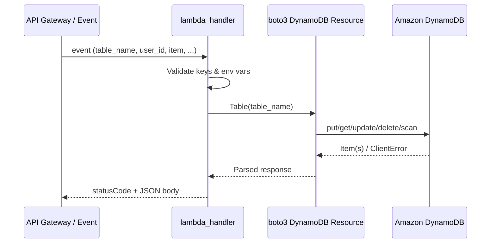

# DynamoDB Lambda Labs — Amazon DynamoDB

Production Python Lambda functions for DynamoDB table and item operations using **boto3** (client + resource).

## Files

| File | Operation | API |
|------|-----------|-----|
| `create_table.py` | Create table | `dynamodb.create_table` |
| `put_item.py` | Insert/replace item | `Table.put_item` |
| `get_item.py` | Read single item | `Table.get_item` |
| `update_item.py` | Partial update | `Table.update_item` |
| `delete_item.py` | Delete item | `Table.delete_item` |
| `scan_items.py` | Scan table | `Table.scan` |

## Service Explanation

**Amazon DynamoDB** is a fully managed NoSQL key-value and document database. Data is stored in **tables** partitioned by a **partition key** (and optional **sort key**). It delivers single-digit millisecond latency at any scale with on-demand or provisioned capacity modes.

## Use Case

User profile API: API Gateway → Lambda → DynamoDB stores user records keyed by `user_id`. Read-heavy paths use `get_item`; admin dashboards use `scan` (with pagination) or Query on a GSI in production.

## Key Concepts

| Concept | Description |
|---------|-------------|
| Partition Key | Primary hash key uniquely identifying items (or grouping them) |
| Sort Key | Optional range key for composite primary key |
| Item | A record — collection of attributes (JSON-like document) |
| On-Demand | Pay per request; no capacity planning |
| Scan vs Query | Scan reads entire table (expensive); Query uses key conditions |

## Lambda Flow



## IAM Policy (Least Privilege)

```json
{
  "Version": "2012-10-17",
  "Statement": [
    {
      "Sid": "DynamoDBLabTableOps",
      "Effect": "Allow",
      "Action": [
        "dynamodb:CreateTable",
        "dynamodb:DescribeTable",
        "dynamodb:PutItem",
        "dynamodb:GetItem",
        "dynamodb:UpdateItem",
        "dynamodb:DeleteItem",
        "dynamodb:Scan",
        "dynamodb:TagResource"
      ],
      "Resource": [
        "arn:aws:dynamodb:us-east-1:ACCOUNT_ID:table/LabUsers",
        "arn:aws:dynamodb:us-east-1:ACCOUNT_ID:table/LabUsers/index/*"
      ]
    }
  ]
}
```

## Deploy via CLI

```bash
cd lambda/dynamodb

zip put_item.zip put_item.py
aws lambda create-function \
  --function-name lab-dynamodb-put-item \
  --runtime python3.11 \
  --role arn:aws:iam::ACCOUNT_ID:role/lab-lambda-dynamodb-role \
  --handler put_item.lambda_handler \
  --zip-file fileb://put_item.zip \
  --environment "Variables={AWS_REGION=us-east-1,TABLE_NAME=LabUsers}" \
  --timeout 30
```

Deploy all six functions with matching handlers. Wait for table `ACTIVE` status before invoking CRUD functions.

## Test

**Local (full CRUD flow):**

```bash
export AWS_REGION=us-east-1
export TABLE_NAME=LabUsers

python create_table.py
# Wait ~10s for table to become ACTIVE
aws dynamodb wait table-exists --table-name LabUsers

python put_item.py
python get_item.py
python update_item.py
python scan_items.py
python delete_item.py
```

**Invoke deployed Lambda:**

```bash
aws lambda invoke \
  --function-name lab-dynamodb-get-item \
  --payload '{"table_name":"LabUsers","user_id":"user-001"}' \
  --cli-binary-format raw-in-base64-out \
  response.json && cat response.json
```

## Cleanup

```bash
# Delete table (removes all items)
aws dynamodb delete-table --table-name LabUsers

# Delete Lambda functions
for fn in create-table put-item get-item update-item delete-item scan-items; do
  aws lambda delete-function --function-name lab-dynamodb-$fn 2>/dev/null || true
done
```

## Cost

| Item | Typical Lab Cost |
|------|------------------|
| On-demand writes | ~$1.25 per million |
| On-demand reads | ~$0.25 per million |
| Storage | ~$0.25/GB/month |

Lab traffic (dozens of operations, tiny table) is **effectively free** under free tier (25 GB storage, 25 WCU/RCU equivalent).

## Security

- Use **fine-grained IAM** scoped to specific table ARNs.
- Enable **encryption at rest** with AWS owned or KMS keys.
- Enable **Point-in-Time Recovery (PITR)** for production tables.
- Avoid `scan` on large tables in production — use Query with GSIs.
- Validate and sanitize input in Lambda before writing to DynamoDB.
- Use **ConditionExpression** to prevent accidental overwrites (not shown in lab; add for production).

## Interview Questions

1. **When should you use Query instead of Scan?**
   Query uses the primary key or GSI and reads only matching partitions; Scan reads every item and consumes read capacity proportional to table size.

2. **What is eventual vs strong consistency for reads?**
   Default reads are eventually consistent; `ConsistentRead=True` on `get_item` provides strongly consistent reads at double the RCU cost.

3. **Explain on-demand vs provisioned capacity.**
   On-demand auto-scales per request; provisioned requires setting RCU/WCU with optional auto-scaling — cheaper at predictable steady workloads.

4. **What is a hot partition?**
   Skewed access to a single partition key throttles throughput; solve with write sharding or random suffixes on keys.

5. **Difference between put_item and update_item?**
   `put_item` replaces the entire item; `update_item` modifies specific attributes atomically with expressions.

## Troubleshooting

| Error | Cause | Fix |
|-------|-------|-----|
| `ResourceNotFoundException` | Table doesn't exist or wrong region | Run `create_table.py`; verify `AWS_REGION` |
| `ValidationException` | Missing partition key in item | Include `user_id` in all write operations |
| `ProvisionedThroughputExceededException` | Throttled (provisioned mode) | Switch to on-demand or increase capacity |
| `ConditionalCheckFailedException` | ConditionExpression not met | Expected in optimistic locking; handle in code |
| Table stuck in `CREATING` | Normal propagation delay | Wait with `aws dynamodb wait table-exists` |

[← Back to Labs Root](../../README.md)
