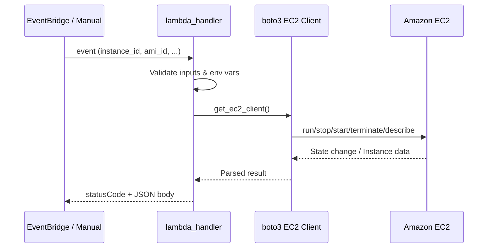

# EC2 Lambda Labs — Amazon Elastic Compute Cloud

Production Python Lambda functions for EC2 instance lifecycle management using **boto3**.

## Files

| File | Operation | API |
|------|-----------|-----|
| `create_instance.py` | Launch instance | `ec2.run_instances` |
| `stop_instance.py` | Stop running instance | `ec2.stop_instances` |
| `start_instance.py` | Start stopped instance | `ec2.start_instances` |
| `terminate_instance.py` | Permanently terminate | `ec2.terminate_instances` |
| `describe_instance.py` | Query instance details | `ec2.describe_instances` |

## Service Explanation

**Amazon EC2** provides resizable compute capacity in the cloud. You launch **instances** (virtual servers) from **AMIs** (machine images), choose **instance types** (CPU/RAM profile), attach **EBS volumes**, and place them in **VPC subnets** with **security groups** controlling network access.

## Use Case

Scheduled cost optimization: EventBridge triggers Lambda nightly → Lambda stops non-production EC2 instances tagged `Environment=dev` → another Lambda starts them Monday morning.

## Key Concepts

| Concept | Description |
|---------|-------------|
| AMI | Template containing OS and optional software |
| Instance Type | Hardware profile (e.g., t3.micro) |
| Instance State | pending → running → stopping → stopped → terminated |
| Security Group | Stateful virtual firewall for instances |
| EBS | Persistent block storage attached to instances |

## Lambda Flow



## IAM Policy (Least Privilege)

```json
{
  "Version": "2012-10-17",
  "Statement": [
    {
      "Sid": "EC2LabInstanceOps",
      "Effect": "Allow",
      "Action": [
        "ec2:RunInstances",
        "ec2:StartInstances",
        "ec2:StopInstances",
        "ec2:TerminateInstances",
        "ec2:DescribeInstances",
        "ec2:CreateTags"
      ],
      "Resource": "*",
      "Condition": {
        "StringEquals": {
          "aws:RequestedRegion": "us-east-1"
        }
      }
    },
    {
      "Sid": "EC2LabRunInstancesDependencies",
      "Effect": "Allow",
      "Action": [
        "ec2:DescribeImages",
        "ec2:DescribeSubnets",
        "ec2:DescribeSecurityGroups"
      ],
      "Resource": "*"
    }
  ]
}
```

> **Note:** `RunInstances` requires permissions on AMIs, subnets, and security groups. Tighten `Resource` to specific ARNs in production.

## Deploy via CLI

```bash
cd lambda/ec2

# Resolve latest Amazon Linux 2023 AMI (example)
AMI_ID=$(aws ssm get-parameters \
  --names /aws/service/ami-amazon-linux-latest/al2023-ami-kernel-default-x86_64 \
  --query 'Parameters[0].Value' --output text)

zip create_instance.zip create_instance.py
aws lambda create-function \
  --function-name lab-ec2-create-instance \
  --runtime python3.11 \
  --role arn:aws:iam::ACCOUNT_ID:role/lab-lambda-ec2-role \
  --handler create_instance.lambda_handler \
  --zip-file fileb://create_instance.zip \
  --environment "Variables={AWS_REGION=us-east-1,AMI_ID=$AMI_ID,INSTANCE_TYPE=t3.micro}" \
  --timeout 60
```

Deploy remaining functions with handlers: `stop_instance.lambda_handler`, `start_instance.lambda_handler`, etc.

## Test

**Local:**

```bash
export AWS_REGION=us-east-1
export AMI_ID=ami-xxxxxxxxxxxxxxxxx   # region-specific AMI
python create_instance.py
export INSTANCE_ID=i-0123456789abcdef0
python describe_instance.py
python stop_instance.py
python start_instance.py
python terminate_instance.py
```

**Invoke deployed Lambda:**

```bash
aws lambda invoke \
  --function-name lab-ec2-describe-instance \
  --payload '{"instance_id":"i-0123456789abcdef0"}' \
  --cli-binary-format raw-in-base64-out \
  response.json && cat response.json
```

## Cleanup

```bash
# Terminate lab instances by tag
aws ec2 describe-instances \
  --filters "Name=tag:Project,Values=aws-fundamentals-boto3" \
  --query 'Reservations[].Instances[?State.Name!=`terminated`].InstanceId' \
  --output text | xargs -n1 aws ec2 terminate-instances --instance-ids

# Delete Lambda functions
for fn in create-instance stop-instance start-instance terminate-instance describe-instance; do
  aws lambda delete-function --function-name lab-ec2-$fn 2>/dev/null || true
done
```

## Cost

| Item | Typical Lab Cost |
|------|------------------|
| t3.micro (on-demand) | ~$0.0104/hour |
| EBS gp3 (8 GB) | ~$0.08/month |
| Stopped instance | No compute charge; EBS still billed |

**Always terminate** instances after labs. A forgotten t3.micro costs ~$7.50/month.

## Security

- Use **IAM instance profiles** instead of embedding credentials on instances.
- Restrict security groups to required ports (SSH/RDP from known IPs only).
- Enable **IMDSv2** (`HttpTokens=required`) to prevent SSRF credential theft.
- Tag instances for ownership and auto-cleanup (`Project=aws-fundamentals-boto3`).
- Never expose admin ports (22, 3389) to `0.0.0.0/0` in production.

## Interview Questions

1. **What is the difference between stop and terminate?**
   Stop preserves the instance ID and EBS root volume; terminate destroys the instance and deletes the root EBS volume by default.

2. **What happens to public IP on stop/start?**
   Default public IPs are released on stop; a new one is assigned on start unless you use an Elastic IP.

3. **Why use Systems Manager Parameter Store for AMI IDs?**
   AMI IDs are region-specific and change frequently; SSM paths provide the latest Amazon-managed AMI dynamically.

4. **Explain EC2 placement groups.**
   Cluster (low latency, same rack), Spread (max hardware isolation), Partition (large distributed workloads).

5. **How does Lambda manage long-running EC2 operations?**
   `stop_instances` returns immediately with `stopping` state; poll `describe_instances` or use EventBridge EC2 state-change events.

## Troubleshooting

| Error | Cause | Fix |
|-------|-------|-----|
| `InvalidAMIID.NotFound` | AMI not in region | Use region-correct AMI from SSM or console |
| `InsufficientInstanceCapacity` | AZ capacity exhausted | Retry different AZ or instance type |
| `UnauthorizedOperation` | IAM missing ec2:* action | Attach policy; check SCPs |
| `InvalidInstanceID.NotFound` | Wrong ID or terminated | Verify instance exists with describe |
| `IncorrectInstanceState` | Action invalid for state | Check state (e.g., can't stop terminated) |

[← Back to Labs Root](../../README.md)
