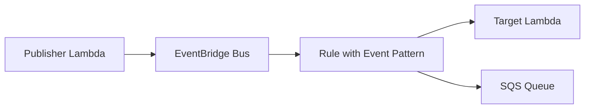

# Amazon EventBridge + Boto3 + Lambda

> Event-driven routing with custom events, rules, and targets.

## Architecture Diagram

```
Event Source (App / AWS Service)
        ↓
   EventBridge Event Bus
        ↓
   Rule → Target (Lambda / SQS / SNS)
```



## What Is Amazon EventBridge?

**Amazon EventBridge** is a serverless event bus that connects applications using events. Rules match event patterns and route matching events to targets.

| Concept | Description |
|---------|-------------|
| **Event bus** | Pipeline for events (`default` or custom) |
| **Event** | JSON with `source`, `detail-type`, and `detail` |
| **Rule** | Event pattern + routing logic |
| **Target** | Destination (Lambda, SQS, SNS, Step Functions, etc.) |
| **Schema registry** | Optional event schema discovery |

## Real-World Use Case

When an order is created, Lambda publishes an `OrderCreated` event. EventBridge routes it to a fulfillment Lambda and an analytics SQS queue based on separate rules.

## AWS Concepts

- **Event-driven architecture**: Services react to events instead of direct calls
- **Content-based filtering**: Rules match on `source`, `detail-type`, or `detail` fields
- **Schedule expressions**: Rules can also trigger on cron schedules
- **Cross-account**: Event buses can receive events from other accounts

## Lambda Flow

1. `put_event.py` publishes a custom event to the bus
2. `create_rule.py` defines an event pattern (e.g. `OrderCreated`)
3. `attach_target.py` links the rule to Lambda, SQS, or SNS
4. EventBridge invokes the target when the pattern matches

## Files in This Module

| File | Purpose |
|------|---------|
| `put_event.py` | Publish a custom event |
| `create_rule.py` | Create/update a rule with event pattern |
| `attach_target.py` | Attach Lambda/SQS/SNS target to a rule |

## Environment Variables

| Variable | Description |
|----------|-------------|
| `EVENT_BUS_NAME` | Event bus name (default: `default`) |
| `EVENT_SOURCE` | Default event source string |
| `EVENT_DETAIL_TYPE` | Default detail type |
| `RULE_NAME` | Rule name for create/attach labs |
| `TARGET_ARN` | Target resource ARN |
| `AWS_REGION` | AWS region (default: `us-east-1`) |

## IAM Permissions

```json
{
  "Version": "2012-10-17",
  "Statement": [
    {
      "Effect": "Allow",
      "Action": [
        "events:PutEvents",
        "events:PutRule",
        "events:PutTargets",
        "events:DescribeRule",
        "events:ListTargetsByRule"
      ],
      "Resource": [
        "arn:aws:events:REGION:ACCOUNT_ID:event-bus/default",
        "arn:aws:events:REGION:ACCOUNT_ID:rule/lab-order-created-rule"
      ]
    },
    {
      "Effect": "Allow",
      "Action": ["lambda:AddPermission"],
      "Resource": "arn:aws:lambda:REGION:ACCOUNT_ID:function:lab-order-processor"
    }
  ]
}
```

Attach `AWSLambdaBasicExecutionRole` for CloudWatch Logs.

## Deployment

```bash
cd lambda/eventbridge
zip eventbridge-lambda.zip *.py

aws lambda create-function \
  --function-name lab-eventbridge-put \
  --runtime python3.11 \
  --handler put_event.lambda_handler \
  --role arn:aws:iam::ACCOUNT_ID:role/lab-eventbridge-role \
  --zip-file fileb://eventbridge-lambda.zip

# Allow EventBridge to invoke target Lambda
aws lambda add-permission \
  --function-name lab-order-processor \
  --statement-id eventbridge-invoke \
  --action lambda:InvokeFunction \
  --principal events.amazonaws.com \
  --source-arn arn:aws:events:us-east-1:ACCOUNT_ID:rule/lab-order-created-rule
```

## Testing

```bash
python create_rule.py
python attach_target.py
python put_event.py

aws events list-rules --event-bus-name default
aws lambda invoke --function-name lab-eventbridge-put --payload file://event.json out.json
```

## Cleanup

```bash
aws events remove-targets --rule lab-order-created-rule --ids lab-target-1
aws events delete-rule --name lab-order-created-rule
aws lambda delete-function --function-name lab-eventbridge-put
```

## Cost Considerations

- **EventBridge**: First 1 million events/month free tier
- **Custom event buses**: Additional charges apply
- **Lambda targets**: Standard Lambda pricing per invocation

## Security Best Practices

- Scope `events:PutEvents` to specific event buses
- Validate event `detail` in target Lambdas
- Use separate rules per domain (orders, payments, shipping)
- Enable CloudTrail for audit of rule changes

## Interview Questions

**Q: EventBridge vs SNS?**  
> EventBridge supports content-based routing with JSON event patterns and many AWS service integrations. SNS is simpler pub/sub with topic subscriptions.

**Q: What is an event pattern?**  
> JSON filter matching event fields like `source`, `detail-type`, or nested `detail` attributes.

**Q: Can one rule have multiple targets?**  
> Yes. A single rule can fan out to Lambda, SQS, SNS, and more simultaneously.

## Troubleshooting

| Error | Fix |
|-------|-----|
| Target not invoked | Confirm rule is ENABLED; verify event pattern matches published event |
| `PutTargets failed` | Check target ARN; add `lambda:AddPermission` for Lambda targets |
| `AccessDenied` on PutEvents | Grant `events:PutEvents` on the event bus ARN |
| Rule exists but no match | Log published event JSON and compare to pattern |
