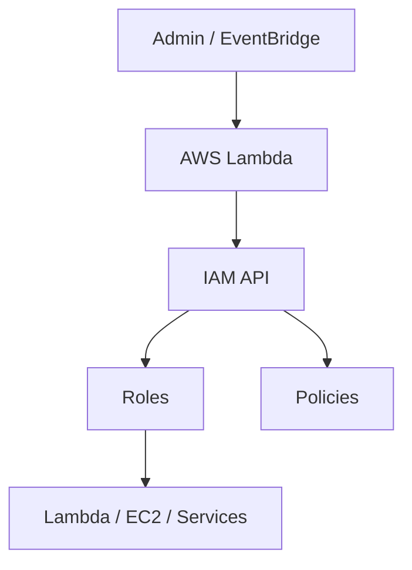

# AWS IAM + Boto3 + Lambda

> Identity and access management fundamentals with hands-on Python examples.

## Architecture Diagram

```
Admin / Automation
        ↓
   AWS Lambda (Boto3)
        ↓
   AWS IAM (Roles / Policies)
```



## What Is AWS IAM?

**AWS Identity and Access Management (IAM)** controls who can access AWS resources and what actions they can perform. IAM is global — it is not tied to a single region.

| Concept | Description |
|---------|-------------|
| **User** | Long-term identity for humans or apps |
| **Group** | Collection of users sharing permissions |
| **Role** | Temporary identity assumed by AWS services or users |
| **Policy** | JSON document defining allowed/denied actions |
| **Trust Policy** | Defines who can assume a role |
| **Permission Policy** | Defines what a role/user can do |

## Real-World Use Case

A platform team uses Lambda to provision IAM roles for new microservices automatically. Each role gets least-privilege policies attached before the service is deployed.

## AWS Concepts

- **Principle of least privilege** — grant only required permissions
- **AssumeRole** — services like Lambda assume an execution role at runtime
- **Managed policies** — AWS-maintained or customer-managed reusable policies
- **Inline policies** — embedded directly on a single role/user
- **Service-linked roles** — pre-defined roles for AWS services

## Lambda Flow

1. Event triggers Lambda (manual invoke, API, or automation)
2. Lambda uses its own execution role credentials (must have `iam:*` permissions)
3. Boto3 `iam` client calls `create_role`, `attach_role_policy`, or `list_roles`
4. Result returned as JSON

## Files in This Module

| File | Purpose |
|------|---------|
| `create_role.py` | Create a new IAM role with trust policy |
| `attach_policy.py` | Attach managed or inline policy to a role |
| `list_roles.py` | List IAM roles in the account |

## Code Walkthrough (`create_role.py`)

| Lines | Purpose |
|-------|---------|
| `LAMBDA_ASSUME_ROLE_POLICY` | Trust policy allowing Lambda to assume the role |
| `iam.create_role(...)` | Creates role with `AssumeRolePolicyDocument` |
| `json.dumps(trust_policy)` | IAM requires policy as JSON string |
| `lambda_handler` | Entry point AWS invokes |

## IAM Permissions

Lambda that manages IAM needs elevated permissions (use only in admin/automation contexts):

```json
{
  "Version": "2012-10-17",
  "Statement": [
    {
      "Effect": "Allow",
      "Action": [
        "iam:CreateRole",
        "iam:AttachRolePolicy",
        "iam:PutRolePolicy",
        "iam:ListRoles",
        "iam:GetRole",
        "iam:PassRole"
      ],
      "Resource": [
        "arn:aws:iam::ACCOUNT_ID:role/boto3-learning-*"
      ]
    },
    {
      "Effect": "Allow",
      "Action": [
        "logs:CreateLogGroup",
        "logs:CreateLogStream",
        "logs:PutLogEvents"
      ],
      "Resource": "arn:aws:logs:*:*:*"
    }
  ]
}
```

## Deployment

```bash
cd lambda/iam
pip install boto3 -t package/
cp *.py package/
cd package && zip -r ../iam-lambda.zip . && cd ..

aws lambda create-function \
  --function-name iam-list-roles-demo \
  --runtime python3.12 \
  --handler list_roles.lambda_handler \
  --role arn:aws:iam::ACCOUNT_ID:role/iam-admin-lambda-role \
  --zip-file fileb://iam-lambda.zip \
  --timeout 30
```

## Testing

```bash
# Local
python list_roles.py

# Lambda invoke
aws lambda invoke \
  --function-name iam-list-roles-demo \
  --payload '{"max_items": 10}' \
  out.json && cat out.json
```

## Cleanup

```bash
aws iam detach-role-policy \
  --role-name boto3-learning-lambda-role \
  --policy-arn arn:aws:iam::aws:policy/service-role/AWSLambdaBasicExecutionRole

aws iam delete-role --role-name boto3-learning-lambda-role
aws lambda delete-function --function-name iam-list-roles-demo
```

## Cost Considerations

- IAM API calls are **free**
- Lambda charges apply per invoke and duration
- No storage cost for IAM itself

## Security Best Practices

- Never embed access keys in Lambda code — use execution roles
- Scope IAM admin Lambdas to specific role name prefixes
- Use AWS CloudTrail to audit IAM changes
- Prefer managed policies over large inline policies for maintainability
- Require MFA for human IAM admin operations

## Interview Questions

**Q: What is the difference between an IAM user and a role?**  
> Users are long-term identities; roles are assumed temporarily and are preferred for Lambda and EC2.

**Q: What is a trust policy?**  
> A policy attached to a role that defines which principal (service, account, user) can call `sts:AssumeRole`.

**Q: Why does Lambda need `iam:PassRole`?**  
> When Lambda creates other resources that need a role (e.g., EC2), it must pass that role — requiring `iam:PassRole`.

## Troubleshooting

| Error | Fix |
|-------|-----|
| `AccessDenied` | Lambda execution role lacks IAM permissions |
| `EntityAlreadyExists` | Role name already exists — pick unique name or delete old role |
| `MalformedPolicyDocument` | Validate trust/permission policy JSON |
| `PassRole` denied | Add `iam:PassRole` for the target role ARN |
