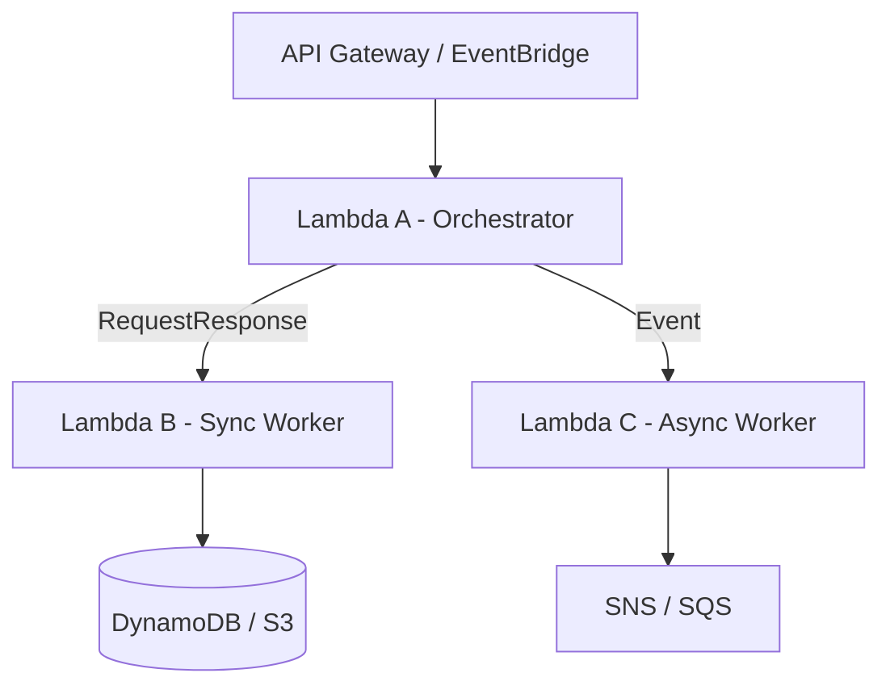

# Lambda-to-Lambda Invocation + Boto3

> Orchestrate serverless workflows by invoking one Lambda from another.

## Architecture Diagram

```
Client / Event
        ↓
   Lambda A (Orchestrator)
        ↓
   Lambda B (Worker)
        ↓
   Downstream Services
```



## What Is Lambda-to-Lambda Invocation?

One Lambda function can invoke another using the AWS Lambda API. This enables **orchestration**, **fan-out**, and **microservice-style** decomposition without managing servers.

| Invocation Type | Behavior |
|-----------------|----------|
| **RequestResponse** | Synchronous — caller waits for response |
| **Event** | Asynchronous — fire-and-forget |
| **DryRun** | Validates permissions without invoking |

## Real-World Use Case

An API Lambda validates an order (Lambda A), then synchronously invokes a payment Lambda (Lambda B). On success, it asynchronously invokes a shipping notification Lambda (Lambda C).

## AWS Concepts

- **Synchronous invoke** — low-latency workflows needing immediate result
- **Asynchronous invoke** — background processing; retries + DLQ/destinations
- **Payload** — JSON event passed to target function
- **FunctionError** — unhandled exception in target (sync only)
- **Concurrency** — each invoke consumes concurrency on target function
- **Cross-account** — requires resource-based policy on target function

## Lambda Flow

1. Lambda A receives request
2. Boto3 `lambda` client calls `invoke` with `FunctionName` and `Payload`
3. For sync: read `Payload` stream from response
4. For async: returns 202 immediately; target runs independently
5. Lambda A returns combined result to caller

## Files in This Module

| File | Purpose |
|------|---------|
| `invoke_lambda.py` | Sync and async Lambda invocation |

## Code Walkthrough (`invoke_lambda.py`)

| Lines | Purpose |
|-------|---------|
| `InvocationType="RequestResponse"` | Synchronous — wait for result |
| `InvocationType="Event"` | Asynchronous — no response body |
| `Payload=json.dumps(payload).encode()` | Must be bytes |
| `response["Payload"].read()` | Read target function response (sync) |
| `FunctionError` | Check for unhandled errors in target |

## IAM Permissions

Lambda A (invoker) needs:

```json
{
  "Version": "2012-10-17",
  "Statement": [
    {
      "Effect": "Allow",
      "Action": ["lambda:InvokeFunction"],
      "Resource": [
        "arn:aws:lambda:REGION:ACCOUNT_ID:function:target-lambda-function",
        "arn:aws:lambda:REGION:ACCOUNT_ID:function:async-worker-*"
      ]
    },
    {
      "Effect": "Allow",
      "Action": [
        "logs:CreateLogGroup",
        "logs:CreateLogStream",
        "logs:PutLogEvents"
      ],
      "Resource": "arn:aws:logs:*:*:*"
    }
  ]
}
```

## Deployment

Deploy both orchestrator and target functions:

```bash
cd lambda/lambda-to-lambda
pip install boto3 -t package/
cp *.py package/
cd package && zip -r ../invoke-lambda.zip . && cd ..

# Target function first
aws lambda create-function \
  --function-name target-lambda-function \
  --runtime python3.12 \
  --handler index.lambda_handler \
  --role arn:aws:iam::ACCOUNT_ID:role/lambda-basic-role \
  --zip-file fileb://target.zip

# Orchestrator
aws lambda create-function \
  --function-name lambda-orchestrator-demo \
  --runtime python3.12 \
  --handler invoke_lambda.lambda_handler \
  --role arn:aws:iam::ACCOUNT_ID:role/lambda-invoke-role \
  --zip-file fileb://invoke-lambda.zip \
  --environment "Variables={TARGET_FUNCTION_NAME=target-lambda-function}" \
  --timeout 60
```

## Testing

```bash
# Local (requires target function to exist)
python invoke_lambda.py

# Sync invoke
aws lambda invoke \
  --function-name lambda-orchestrator-demo \
  --payload '{"function_name":"target-lambda-function","payload":{"action":"ping"},"invocation_type":"RequestResponse"}' \
  out.json && cat out.json

# Async invoke
aws lambda invoke \
  --function-name lambda-orchestrator-demo \
  --payload '{"function_name":"target-lambda-function","payload":{"action":"notify"},"invocation_type":"Event"}' \
  out.json && cat out.json
```

## Cleanup

```bash
aws lambda delete-function --function-name lambda-orchestrator-demo
aws lambda delete-function --function-name target-lambda-function
```

## Cost Considerations

- **Double billing** — both orchestrator and target incur Lambda charges
- Sync chains add latency and total duration cost
- Async invokes still charge target function execution
- Consider Step Functions for complex multi-step workflows
- API Gateway + single Lambda may be simpler for shallow chains

## Security Best Practices

- Scope `lambda:InvokeFunction` to specific target ARNs
- Validate payloads before forwarding to downstream Lambdas
- Use async + DLQ for fault-tolerant background work
- Avoid infinite recursion (Lambda A → Lambda B → Lambda A)
- Set reserved concurrency on critical downstream functions
- Use X-Ray to trace cross-function calls

## Interview Questions

**Q: Sync vs async Lambda invoke?**  
> Sync (`RequestResponse`) waits for the result; async (`Event`) returns immediately and processes in background with retries.

**Q: Lambda-to-Lambda vs Step Functions?**  
> Simple 1–2 step chains work with direct invoke; Step Functions handles long workflows, branching, and visual state machines.

**Q: What happens if the target Lambda fails in sync mode?**  
> Invoker receives `FunctionError` in response; must handle and optionally retry or compensate.

## Troubleshooting

| Error | Fix |
|-------|-----|
| `AccessDeniedException` | Add `lambda:InvokeFunction` on target ARN |
| `ResourceNotFoundException` | Target function name/region incorrect |
| `TooManyRequestsException` | Target throttled — increase concurrency or backoff |
| Recursive loop | Set reserved concurrency or use circuit breaker |
| Empty Payload response | Target returned void or async invoke (no body) |
