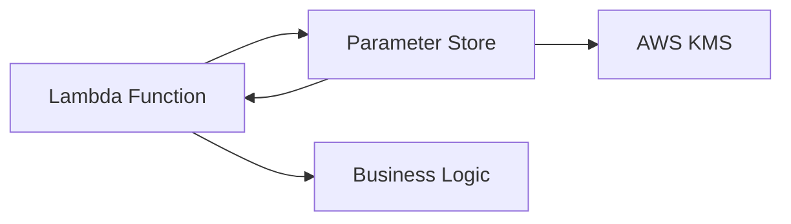

# AWS Systems Manager Parameter Store + Boto3 + Lambda

> Centralized configuration management for Lambda applications.

## Architecture Diagram

```
Application / Lambda
        ↓
   AWS Lambda (Boto3)
        ↓
   SSM Parameter Store
        ↓
   KMS (SecureString)
```



## What Is Parameter Store?

**AWS Systems Manager Parameter Store** provides hierarchical storage for configuration data and secrets. It is part of AWS Systems Manager (SSM).

| Concept | Description |
|---------|-------------|
| **Parameter** | Named config value (e.g., `/app/prod/db/host`) |
| **String** | Plain text value |
| **StringList** | Comma-separated values |
| **SecureString** | Encrypted with KMS |
| **Hierarchy** | Path-based naming (`/team/app/env/key`) |
| **Standard / Advanced** | Tiers with different throughput limits |

## Real-World Use Case

A Lambda function reads feature flags and API endpoints from Parameter Store at runtime. Ops updates parameters without redeploying Lambda code.

## AWS Concepts

- **Hierarchical paths** — organize by environment (`/prod/`, `/dev/`)
- **SecureString** — sensitive values encrypted with KMS
- **Versioning** — each update increments version number
- **Parameter policies** — expiration and notification policies (advanced tier)
- **Free Standard tier** — up to 10,000 parameters (Standard)

## Lambda Flow

1. Lambda needs configuration (feature flag, endpoint URL)
2. Boto3 `ssm` client calls `get_parameter` with `WithDecryption=True` for SecureString
3. Value used in application logic
4. Cache in memory with reasonable TTL for high-traffic functions

## Files in This Module

| File | Purpose |
|------|---------|
| `put_parameter.py` | Create or update a parameter |
| `get_parameter.py` | Retrieve parameter value |
| `delete_parameter.py` | Remove a parameter |

## Code Walkthrough (`put_parameter.py`)

| Lines | Purpose |
|-------|---------|
| `put_parameter(Name=..., Value=..., Type=...)` | Creates or updates parameter |
| `Type="SecureString"` | Encrypts value with default or custom KMS key |
| `Overwrite=True` | Updates existing parameter instead of failing |
| `get_parameter(WithDecryption=True)` | Decrypts SecureString on read |

## IAM Permissions

```json
{
  "Version": "2012-10-17",
  "Statement": [
    {
      "Effect": "Allow",
      "Action": [
        "ssm:PutParameter",
        "ssm:GetParameter",
        "ssm:GetParameters",
        "ssm:DeleteParameter",
        "ssm:DescribeParameters"
      ],
      "Resource": "arn:aws:ssm:REGION:ACCOUNT_ID:parameter/boto3-learning/*"
    },
    {
      "Effect": "Allow",
      "Action": ["kms:Decrypt", "kms:Encrypt"],
      "Resource": "arn:aws:kms:REGION:ACCOUNT_ID:key/*",
      "Condition": {
        "StringEquals": {
          "kms:ViaService": "ssm.REGION.amazonaws.com"
        }
      }
    },
    {
      "Effect": "Allow",
      "Action": [
        "logs:CreateLogGroup",
        "logs:CreateLogStream",
        "logs:PutLogEvents"
      ],
      "Resource": "arn:aws:logs:*:*:*"
    }
  ]
}
```

## Deployment

```bash
cd lambda/parameterstore
pip install boto3 -t package/
cp *.py package/
cd package && zip -r ../ssm-lambda.zip . && cd ..

aws lambda create-function \
  --function-name ssm-get-parameter-demo \
  --runtime python3.12 \
  --handler get_parameter.lambda_handler \
  --role arn:aws:iam::ACCOUNT_ID:role/ssm-lambda-role \
  --zip-file fileb://ssm-lambda.zip \
  --environment "Variables={PARAMETER_NAME=/boto3-learning/app/config}" \
  --timeout 30
```

## Testing

```bash
# Put parameter
python put_parameter.py

# Get parameter
python get_parameter.py

# Lambda invoke
aws lambda invoke \
  --function-name ssm-get-parameter-demo \
  --payload '{"parameter_name":"/boto3-learning/app/config"}' \
  out.json && cat out.json
```

## Cleanup

```bash
aws ssm delete-parameter --name /boto3-learning/app/config
aws lambda delete-function --function-name ssm-get-parameter-demo
```

## Cost Considerations

- **Standard parameters** — free (up to 10,000)
- **Advanced parameters** — $0.05 per parameter per month
- **API throughput** — Standard: low; Advanced: higher TPS
- API calls above free tier: minimal cost
- Lambda charges apply separately

## Security Best Practices

- Use `SecureString` for sensitive config (not plain `String`)
- Apply least-privilege IAM scoped to parameter path prefix
- Use hierarchical naming to separate environments
- Do not log parameter values in CloudWatch
- Use VPC interface endpoints for private SSM access
- Prefer Parameter Store for non-rotating config; Secrets Manager for credentials with rotation

## Interview Questions

**Q: When to use Parameter Store vs Secrets Manager?**  
> Parameter Store for config and non-rotating secrets (cheaper); Secrets Manager when you need rotation and audit for credentials.

**Q: What is a SecureString?**  
> A parameter type encrypted with KMS; requires `WithDecryption=True` on read.

**Q: How do you organize parameters at scale?**  
> Use path hierarchy: `/company/app/environment/parameter-name`.

## Troubleshooting

| Error | Fix |
|-------|-----|
| `ParameterNotFound` | Check name, region, and path (leading `/`) |
| `AccessDeniedException` | Verify IAM path scope and KMS permissions |
| `ParameterAlreadyExists` | Set `overwrite: true` in put_parameter |
| Throttling | Upgrade to Advanced tier or add caching |
