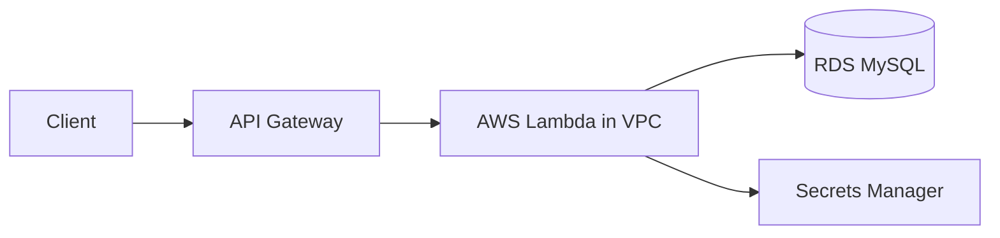

# Amazon RDS + Boto3 + Lambda

> Relational database operations from Lambda using `mysql-connector-python`.

## Architecture Diagram

```
API Gateway
     ↓
AWS Lambda (in VPC)
     ↓
Amazon RDS MySQL
```



## What Is Amazon RDS?

**Amazon Relational Database Service (RDS)** runs managed relational databases (MySQL, PostgreSQL, MariaDB, Oracle, SQL Server) so you focus on data, not patching and backups.

| Concept | Description |
|---------|-------------|
| **DB Instance** | Managed database server in a VPC |
| **Engine** | MySQL, PostgreSQL, etc. |
| **Security Group** | Controls inbound DB access (port 3306 for MySQL) |
| **Subnet Group** | Subnets where RDS can be placed |
| **RDS Proxy** | Connection pooling for Lambda (recommended in production) |

## Real-World Use Case

An order API stores customer records in RDS MySQL. Lambda in a private subnet connects through RDS Proxy to avoid connection exhaustion during traffic spikes.

## AWS Concepts

- **VPC placement**: Lambda must run in the same VPC as RDS to reach private endpoints
- **Security groups**: Allow Lambda security group → RDS security group on port 3306
- **Connection handling**: Open/close connections per invocation in labs; use RDS Proxy in production
- **Secrets**: Store `DB_PASSWORD` in Secrets Manager, not plain environment variables

## Lambda Flow

1. API Gateway invokes Lambda with order payload
2. Lambda reads DB credentials from env vars (or Secrets Manager)
3. `mysql-connector-python` opens a connection to RDS
4. SQL runs (CREATE, INSERT, SELECT, UPDATE, DELETE)
5. Connection closes; JSON response returned

## Files in This Module

| File | Purpose |
|------|---------|
| `create_database.py` | Create a MySQL database |
| `create_table.py` | Create an `employees` sample table |
| `insert_data.py` | Insert a row |
| `select_data.py` | Query rows by id or list recent rows |
| `update_data.py` | Update a row |
| `delete_data.py` | Delete a row by id |

## Environment Variables

| Variable | Description |
|----------|-------------|
| `DB_HOST` | RDS endpoint (e.g. `mydb.xxxx.us-east-1.rds.amazonaws.com`) |
| `DB_USER` | Database username |
| `DB_PASSWORD` | Database password |
| `DB_NAME` | Default database name (default: `lab_db`) |
| `DB_PORT` | MySQL port (default: `3306`) |

## IAM Permissions

Lambda needs VPC access and optional Secrets Manager read:

```json
{
  "Version": "2012-10-17",
  "Statement": [
    {
      "Effect": "Allow",
      "Action": [
        "ec2:CreateNetworkInterface",
        "ec2:DescribeNetworkInterfaces",
        "ec2:DeleteNetworkInterface"
      ],
      "Resource": "*"
    },
    {
      "Effect": "Allow",
      "Action": ["secretsmanager:GetSecretValue"],
      "Resource": "arn:aws:secretsmanager:REGION:ACCOUNT_ID:secret:lab/rds/*"
    }
  ]
}
```

Attach `AWSLambdaBasicExecutionRole` for CloudWatch Logs.

## Deployment

Package `mysql-connector-python` with your handler (Lambda Layer recommended):

```bash
cd lambda/rds
pip install mysql-connector-python -t package/
cp *.py package/
cd package && zip -r ../rds-lambda.zip . && cd ..

aws lambda create-function \
  --function-name lab-rds-insert \
  --runtime python3.11 \
  --handler insert_data.lambda_handler \
  --role arn:aws:iam::ACCOUNT_ID:role/lab-rds-lambda-role \
  --zip-file fileb://rds-lambda.zip \
  --timeout 30 \
  --vpc-config SubnetIds=subnet-xxx,subnet-yyy,SecurityGroupIds=sg-xxx \
  --environment "Variables={DB_HOST=mydb.xxxx.rds.amazonaws.com,DB_USER=admin,DB_PASSWORD=SECRET,DB_NAME=lab_db}"
```

## Testing

```bash
export DB_HOST=mydb.xxxx.rds.amazonaws.com
export DB_USER=admin
export DB_PASSWORD=your-password
export DB_NAME=lab_db

python create_database.py
python create_table.py
python insert_data.py
python select_data.py
```

## Cleanup

```bash
aws rds delete-db-instance --db-instance-identifier lab-mysql --skip-final-snapshot
aws lambda delete-function --function-name lab-rds-insert
```

Drop lab tables/databases manually if keeping the RDS instance.

## Cost Considerations

- **RDS**: `db.t3.micro` free tier eligible; running 24/7 adds up quickly
- **NAT Gateway**: Required if Lambda in private subnet needs internet — significant cost
- **Lambda**: Minimal for lab invocations
- Stop/delete RDS instances when labs are complete

## Security Best Practices

- Place RDS in private subnets; no public accessibility for production
- Use Secrets Manager or Parameter Store for credentials
- Enable encryption at rest and in transit (SSL)
- Use RDS Proxy with Lambda to pool connections
- Restrict security groups to least privilege

## Interview Questions

**Q: Why must Lambda be in a VPC to reach RDS?**  
> Private RDS endpoints are only reachable inside the VPC. Lambda needs VPC configuration and ENIs to connect.

**Q: Why is RDS Proxy recommended with Lambda?**  
> Each Lambda invocation can open a new DB connection. Proxy reuses connections and prevents exhausting the DB connection limit.

**Q: How do you handle SQL injection?**  
> Use parameterized queries (`%s` placeholders) — never concatenate user input into SQL strings.

## Troubleshooting

| Error | Fix |
|-------|-----|
| `Can't connect to MySQL server` | Check VPC, subnets, security groups, and RDS endpoint |
| `Access denied for user` | Verify username/password and host grants |
| Lambda timeout | Increase timeout; check cold start + VPC ENI creation |
| `ModuleNotFoundError: mysql` | Package `mysql-connector-python` in deployment ZIP or Layer |
