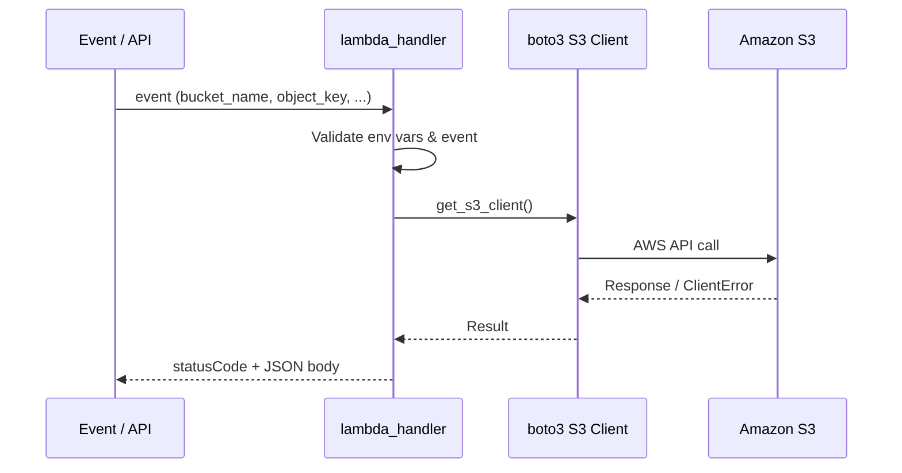

# S3 Lambda Labs — Amazon Simple Storage Service

Production Python Lambda functions for S3 bucket and object operations using **boto3**.

## Files

| File | Operation | API |
|------|-----------|-----|
| `create_bucket.py` | Create bucket + block public access | `s3.create_bucket`, `put_public_access_block` |
| `upload_file.py` | Upload object content | `s3.put_object` |
| `list_objects.py` | List bucket contents | `s3.list_objects_v2` |
| `delete_object.py` | Delete single object | `s3.delete_object` |

## Service Explanation

**Amazon S3** is object storage built to store and retrieve any amount of data. Objects live in **buckets** and are identified by **keys** (paths). S3 provides 11 nines of durability, versioning, lifecycle policies, and event notifications — making it the default store for logs, backups, static assets, and data lakes.

## Use Case

A serverless image-processing pipeline: API Gateway triggers Lambda on upload → Lambda writes processed thumbnails back to S3 → S3 event triggers another Lambda for metadata indexing.

## Key Concepts

| Concept | Description |
|---------|-------------|
| Bucket | Global namespace container for objects |
| Key | Unique object identifier within a bucket |
| Region | Bucket is created in a specific AWS region |
| ACL / Policy | Access control at bucket and object level |
| Block Public Access | Account/bucket setting to prevent public exposure |

## Lambda Flow



## IAM Policy (Least Privilege)

```json
{
  "Version": "2012-10-17",
  "Statement": [
    {
      "Sid": "S3LabBucketOps",
      "Effect": "Allow",
      "Action": [
        "s3:CreateBucket",
        "s3:PutPublicAccessBlock",
        "s3:PutObject",
        "s3:GetObject",
        "s3:ListBucket",
        "s3:DeleteObject"
      ],
      "Resource": [
        "arn:aws:s3:::my-lambda-lab-bucket-*",
        "arn:aws:s3:::my-lambda-lab-bucket-*/*"
      ]
    }
  ]
}
```

## Deploy via CLI

```bash
cd lambda/s3

# Package and deploy create_bucket
zip create_bucket.zip create_bucket.py
aws lambda create-function \
  --function-name lab-s3-create-bucket \
  --runtime python3.11 \
  --role arn:aws:iam::ACCOUNT_ID:role/lab-lambda-s3-role \
  --handler create_bucket.lambda_handler \
  --zip-file fileb://create_bucket.zip \
  --environment "Variables={AWS_REGION=us-east-1,BUCKET_NAME=my-lambda-lab-bucket-12345}" \
  --timeout 30

# Update code after changes
aws lambda update-function-code \
  --function-name lab-s3-create-bucket \
  --zip-file fileb://create_bucket.zip
```

Repeat for `upload_file`, `list_objects`, and `delete_object` with matching handlers.

## Test

**Local:**

```bash
export AWS_REGION=us-east-1
export BUCKET_NAME=my-lambda-lab-bucket-$(date +%s)
python create_bucket.py
python upload_file.py
python list_objects.py
python delete_object.py
```

**Invoke deployed Lambda:**

```bash
aws lambda invoke \
  --function-name lab-s3-upload-file \
  --payload '{"bucket_name":"my-lambda-lab-bucket-12345","object_key":"uploads/test.txt","body":"Hello"}' \
  --cli-binary-format raw-in-base64-out \
  response.json && cat response.json
```

## Cleanup

```bash
# Delete all objects, then bucket
aws s3 rm s3://my-lambda-lab-bucket-12345 --recursive
aws s3 rb s3://my-lambda-lab-bucket-12345

# Remove Lambda functions
aws lambda delete-function --function-name lab-s3-create-bucket
aws lambda delete-function --function-name lab-s3-upload-file
aws lambda delete-function --function-name lab-s3-list-objects
aws lambda delete-function --function-name lab-s3-delete-object
```

## Cost

| Item | Typical Lab Cost |
|------|------------------|
| Storage | ~$0.023/GB/month (first 50 TB) |
| PUT requests | ~$0.005 per 1,000 |
| GET/LIST | ~$0.0004 per 1,000 |
| Lambda | Free tier: 1M requests/month |

Lab usage (few MB, dozens of requests) is effectively **&lt; $0.01**.

## Security

- Enable **Block Public Access** on all buckets (done in `create_bucket.py`).
- Use bucket policies with `aws:PrincipalArn` conditions for cross-service access.
- Encrypt at rest with SSE-S3 or SSE-KMS.
- Never log object contents containing PII.
- Use presigned URLs for temporary client access instead of public buckets.

## Interview Questions

1. **What is the difference between S3 Standard and S3 Intelligent-Tiering?**
   Standard is for frequently accessed data; Intelligent-Tiering auto-moves objects between access tiers based on usage patterns.

2. **Why must `LocationConstraint` be omitted for `us-east-1`?**
   `us-east-1` is the default region; specifying a constraint for it causes a `IllegalLocationConstraintException`.

3. **How do S3 event notifications integrate with Lambda?**
   S3 can publish `s3:ObjectCreated:*` events to Lambda, SNS, or SQS for event-driven processing.

4. **What happens when you delete a bucket with objects?**
   AWS returns `BucketNotEmpty` until all objects (and version delete markers) are removed.

5. **Strong consistency in S3 — when was it introduced?**
   December 2020; all S3 operations now provide read-after-write consistency.

## Troubleshooting

| Error | Cause | Fix |
|-------|-------|-----|
| `BucketAlreadyExists` | Bucket name taken globally | Use a unique suffix (account ID, timestamp) |
| `AccessDenied` | IAM missing permission | Add action to role policy; check SCPs |
| `NoSuchBucket` | Wrong name or region | Verify bucket exists in target region |
| `IllegalLocationConstraintException` | Wrong region config for us-east-1 | Omit `CreateBucketConfiguration` for us-east-1 |
| `PermanentRedirect` | Client region mismatch | Set `AWS_REGION` to bucket's region |

[← Back to Labs Root](../../README.md)
