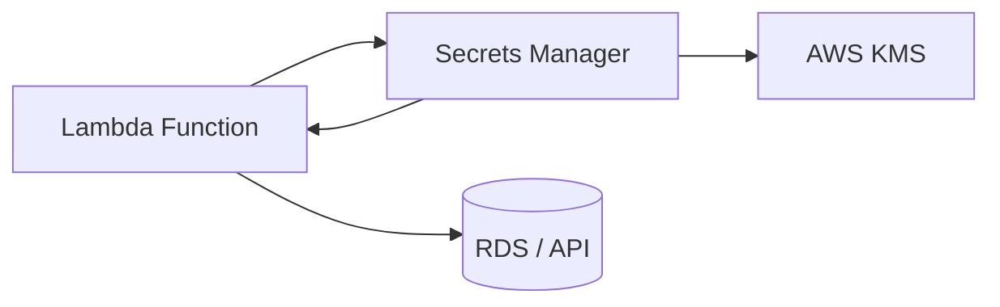

# AWS Secrets Manager + Boto3 + Lambda

> Secure secret storage and retrieval from Lambda functions.

## Architecture Diagram

```
Application / Lambda
        ↓
   AWS Lambda (Boto3)
        ↓
   AWS Secrets Manager
        ↓
   KMS Encryption
```



## What Is AWS Secrets Manager?

**AWS Secrets Manager** helps you store, manage, and rotate credentials, API keys, and other secrets. Secrets are encrypted at rest using AWS KMS.

| Concept | Description |
|---------|-------------|
| **Secret** | Named container for sensitive data |
| **Secret String** | Text or JSON value |
| **Version** | Each update creates a new version |
| **Rotation** | Automatic credential rotation via Lambda |
| **Recovery Window** | Scheduled deletion with undo period |

## Real-World Use Case

A Lambda function retrieves database credentials from Secrets Manager at cold start, connects to RDS, and never stores passwords in environment variables or code.

## AWS Concepts

- **Encryption** — secrets encrypted with KMS keys (default or customer-managed)
- **Rotation** — Lambda rotates secrets on a schedule (e.g., every 30 days)
- **Resource policy** — cross-account secret access
- **Version stages** — `AWSCURRENT`, `AWSPENDING` during rotation
- **Recovery window** — 7–30 days before permanent deletion

## Lambda Flow

1. Lambda starts and needs a secret (DB password, API key)
2. Boto3 `secretsmanager` client calls `get_secret_value`
3. Secret decrypted by KMS (if execution role has `kms:Decrypt`)
4. Lambda uses value in memory only — never log secrets

## Files in This Module

| File | Purpose |
|------|---------|
| `create_secret.py` | Create a new secret |
| `get_secret.py` | Retrieve current secret value |
| `update_secret.py` | Update secret (new version) |
| `delete_secret.py` | Schedule or force-delete a secret |

## Code Walkthrough (`get_secret.py`)

| Lines | Purpose |
|-------|---------|
| `get_secret_value(SecretId=...)` | Fetches decrypted secret |
| `WithDecryption` | Not needed for Secrets Manager (always decrypted on get) |
| `json.loads(secret_string)` | Parse JSON secrets (e.g., DB credentials) |
| Never log `secret_string` | Security — avoid CloudWatch exposure |

## IAM Permissions

```json
{
  "Version": "2012-10-17",
  "Statement": [
    {
      "Effect": "Allow",
      "Action": [
        "secretsmanager:CreateSecret",
        "secretsmanager:GetSecretValue",
        "secretsmanager:PutSecretValue",
        "secretsmanager:DeleteSecret",
        "secretsmanager:DescribeSecret"
      ],
      "Resource": "arn:aws:secretsmanager:REGION:ACCOUNT_ID:secret:boto3-learning/*"
    },
    {
      "Effect": "Allow",
      "Action": ["kms:Decrypt", "kms:GenerateDataKey"],
      "Resource": "arn:aws:kms:REGION:ACCOUNT_ID:key/*"
    },
    {
      "Effect": "Allow",
      "Action": [
        "logs:CreateLogGroup",
        "logs:CreateLogStream",
        "logs:PutLogEvents"
      ],
      "Resource": "arn:aws:logs:*:*:*"
    }
  ]
}
```

## Deployment

```bash
cd lambda/secretsmanager
pip install boto3 -t package/
cp *.py package/
cd package && zip -r ../secrets-lambda.zip . && cd ..

aws lambda create-function \
  --function-name secrets-get-demo \
  --runtime python3.12 \
  --handler get_secret.lambda_handler \
  --role arn:aws:iam::ACCOUNT_ID:role/secrets-lambda-role \
  --zip-file fileb://secrets-lambda.zip \
  --environment "Variables={SECRET_NAME=boto3-learning/db-credentials}" \
  --timeout 30
```

## Testing

```bash
# Create secret locally
python create_secret.py

# Retrieve
python get_secret.py

# Lambda invoke
aws lambda invoke \
  --function-name secrets-get-demo \
  --payload '{"secret_name":"boto3-learning/db-credentials"}' \
  out.json && cat out.json
```

## Cleanup

```bash
aws secretsmanager delete-secret \
  --secret-id boto3-learning/db-credentials \
  --force-delete-without-recovery

aws lambda delete-function --function-name secrets-get-demo
```

## Cost Considerations

- **$0.40 per secret per month**
- **$0.05 per 10,000 API calls**
- KMS key usage may add additional charges
- Lambda invoke charges apply separately

## Security Best Practices

- Never log secret values to CloudWatch
- Use resource-scoped IAM policies (`boto3-learning/*`)
- Enable automatic rotation for database credentials
- Prefer Secrets Manager over plain env vars for passwords
- Use VPC endpoints for private access from VPC Lambdas
- Restrict cross-account access with resource policies

## Interview Questions

**Q: Secrets Manager vs Parameter Store SecureString?**  
> Secrets Manager supports automatic rotation and versioning; Parameter Store is cheaper for simple config without rotation.

**Q: How does secret rotation work?**  
> A rotation Lambda creates a new credential, tests it, moves `AWSCURRENT` to the new version, and retires the old one.

**Q: Can Lambda cache secrets?**  
> Yes, but set TTL and handle rotation — stale cached secrets cause auth failures.

## Troubleshooting

| Error | Fix |
|-------|-----|
| `AccessDeniedException` | Check IAM and KMS decrypt permissions |
| `ResourceNotFoundException` | Verify secret name/ARN and region |
| `InvalidRequestException` | Secret already scheduled for deletion |
| Secret in logs | Remove logging of secret values immediately |
