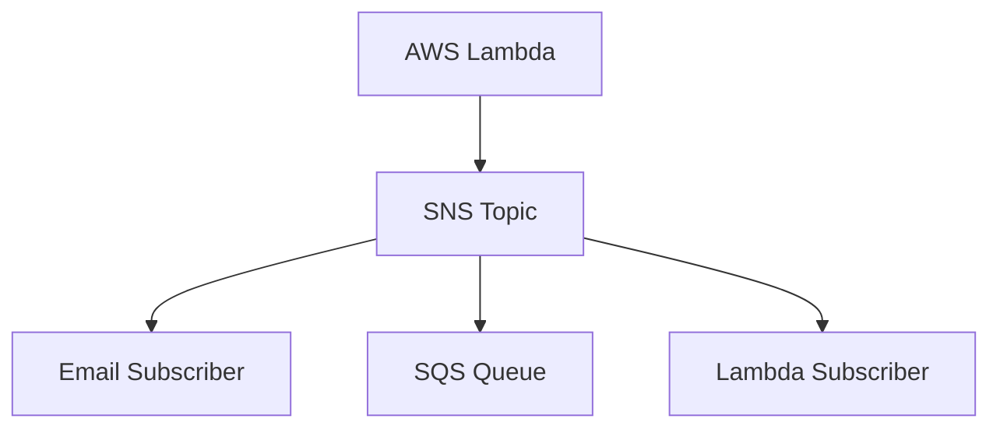

# Amazon SNS + Boto3 + Lambda

> Pub/sub notifications with SNS topics, subscriptions, and Lambda publishers.

## Architecture Diagram

```
Publisher (Lambda / App)
        ↓
   Amazon SNS Topic
        ↓
   Subscribers (Email, SMS, Lambda, SQS)
```



## What Is Amazon SNS?

**Amazon Simple Notification Service (SNS)** is a managed pub/sub messaging service. Publishers send messages to a **topic**; subscribers receive copies based on their protocol.

| Concept | Description |
|---------|-------------|
| **Topic** | Named channel for messages (ARN identifies it) |
| **Publisher** | Sends messages to the topic |
| **Subscriber** | Receives messages (email, SMS, Lambda, SQS, HTTP) |
| **Fan-out** | One publish → many subscribers |
| **Filter policy** | Optional JSON filter on subscription |

## Real-World Use Case

When an order ships, Lambda publishes to an SNS topic. Email alerts the customer, SQS queues a warehouse update, and another Lambda updates analytics.

## AWS Concepts

- **Pub/Sub**: Decouples senders from receivers
- **At-least-once delivery**: Subscribers should be idempotent
- **Email confirmation**: Email subscriptions require user confirmation
- **Topic policies**: Control who can publish/subscribe

## Lambda Flow

1. Business event triggers Lambda
2. Lambda calls `sns.publish()` with topic ARN and message
3. SNS delivers to all confirmed subscribers
4. Lambda returns message ID

## Files in This Module

| File | Purpose |
|------|---------|
| `publish_message.py` | Publish a message to a topic |
| `subscribe_email.py` | Add an email subscription |
| `unsubscribe.py` | Remove a subscription by ARN |

## Environment Variables

| Variable | Description |
|----------|-------------|
| `TOPIC_ARN` | SNS topic ARN |
| `EMAIL` | Email address for subscribe lab |
| `SUBSCRIPTION_ARN` | Subscription ARN for unsubscribe lab |
| `AWS_REGION` | AWS region (default: `us-east-1`) |

## IAM Permissions

```json
{
  "Version": "2012-10-17",
  "Statement": [
    {
      "Effect": "Allow",
      "Action": [
        "sns:Publish",
        "sns:Subscribe",
        "sns:Unsubscribe",
        "sns:ListSubscriptionsByTopic"
      ],
      "Resource": "arn:aws:sns:REGION:ACCOUNT_ID:lab-notifications"
    }
  ]
}
```

Attach `AWSLambdaBasicExecutionRole` for CloudWatch Logs.

## Deployment

```bash
cd lambda/sns
zip sns-lambda.zip *.py

aws lambda create-function \
  --function-name lab-sns-publish \
  --runtime python3.11 \
  --handler publish_message.lambda_handler \
  --role arn:aws:iam::ACCOUNT_ID:role/lab-sns-lambda-role \
  --zip-file fileb://sns-lambda.zip \
  --environment "Variables={TOPIC_ARN=arn:aws:sns:us-east-1:ACCOUNT_ID:lab-notifications}"
```

## Testing

```bash
export TOPIC_ARN=arn:aws:sns:us-east-1:ACCOUNT_ID:lab-notifications
python publish_message.py

export EMAIL=you@example.com
python subscribe_email.py

aws lambda invoke \
  --function-name lab-sns-publish \
  --payload '{"message":"Test from CLI","subject":"Lab Test"}' \
  out.json && cat out.json
```

## Cleanup

```bash
aws sns delete-topic --topic-arn arn:aws:sns:us-east-1:ACCOUNT_ID:lab-notifications
aws lambda delete-function --function-name lab-sns-publish
```

## Cost Considerations

- **SNS**: First 1 million requests/month free tier; then ~$0.50 per million
- **Email/SMS**: Additional delivery charges for SMS; email via SNS is low cost
- **Lambda**: Per invoke + duration

## Security Best Practices

- Restrict `sns:Publish` to specific topic ARNs
- Use topic policies to limit publishers
- Avoid sensitive data in message bodies; use references instead
- Enable encryption with KMS for regulated workloads

## Interview Questions

**Q: SNS vs SQS?**  
> SNS is pub/sub (fan-out to many). SQS is a queue (one consumer processes each message, with optional DLQ).

**Q: What happens if a subscriber fails?**  
> SNS retries delivery for supported protocols. Dead-letter handling depends on subscriber type (e.g. Lambda DLQ).

**Q: Why must email subscribers confirm?**  
> Prevents spam — users must opt in via confirmation link.

## Troubleshooting

| Error | Fix |
|-------|-----|
| `NotFound` on publish | Verify topic ARN and region |
| Email not received | Confirm subscription; check spam folder |
| `AuthorizationError` | Add `sns:Publish` to Lambda role |
| `InvalidParameter` on subscribe | Use valid email format and `Protocol=email` |
