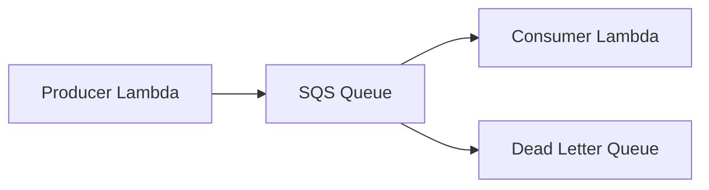

# Amazon SQS + Boto3 + Lambda

> Reliable message queuing with send, receive, and delete operations.

## Architecture Diagram

```
Producer (Lambda / App)
        ↓
   Amazon SQS Queue
        ↓
   Consumer (Lambda / Worker)
```



## What Is Amazon SQS?

**Amazon Simple Queue Service (SQS)** is a fully managed message queue. Producers send messages; consumers poll, process, and delete them.

| Concept | Description |
|---------|-------------|
| **Queue** | Buffer for messages (standard or FIFO) |
| **Message** | Payload + metadata + receipt handle |
| **Visibility timeout** | Hide message from other consumers while processing |
| **DLQ** | Dead Letter Queue for failed messages |
| **Long polling** | `WaitTimeSeconds` reduces empty receives |

## Real-World Use Case

An order Lambda enqueues payment jobs to SQS. Worker Lambdas process messages asynchronously, retry on failure, and send poison messages to a DLQ.

## AWS Concepts

- **At-least-once delivery**: Process idempotently
- **Visibility timeout**: Must finish processing before timeout or message reappears
- **Batching**: Lambda SQS trigger can process batches of up to 10 messages
- **FIFO queues**: Exactly-once ordering (different API from standard queues)

## Lambda Flow

1. Producer Lambda calls `send_message` with queue URL
2. Consumer Lambda calls `receive_message` (or triggered by SQS event source)
3. After successful processing, `delete_message` with receipt handle
4. Failed processing leaves message for retry after visibility timeout

## Files in This Module

| File | Purpose |
|------|---------|
| `send_message.py` | Enqueue a message |
| `receive_message.py` | Poll messages from the queue |
| `delete_message.py` | Remove a message after processing |

## Environment Variables

| Variable | Description |
|----------|-------------|
| `QUEUE_URL` | Full SQS queue URL |
| `AWS_REGION` | AWS region (default: `us-east-1`) |

## IAM Permissions

```json
{
  "Version": "2012-10-17",
  "Statement": [
    {
      "Effect": "Allow",
      "Action": [
        "sqs:SendMessage",
        "sqs:ReceiveMessage",
        "sqs:DeleteMessage",
        "sqs:GetQueueAttributes"
      ],
      "Resource": "arn:aws:sqs:REGION:ACCOUNT_ID:lab-queue"
    }
  ]
}
```

Attach `AWSLambdaBasicExecutionRole` for CloudWatch Logs.

## Deployment

```bash
cd lambda/sqs
zip sqs-lambda.zip *.py

aws lambda create-function \
  --function-name lab-sqs-send \
  --runtime python3.11 \
  --handler send_message.lambda_handler \
  --role arn:aws:iam::ACCOUNT_ID:role/lab-sqs-lambda-role \
  --zip-file fileb://sqs-lambda.zip \
  --environment "Variables={QUEUE_URL=https://sqs.us-east-1.amazonaws.com/ACCOUNT_ID/lab-queue}"
```

## Testing

```bash
export QUEUE_URL=https://sqs.us-east-1.amazonaws.com/ACCOUNT_ID/lab-queue

python send_message.py
python receive_message.py
# Copy receipt_handle from output, then:
python delete_message.py

aws sqs get-queue-attributes --queue-url $QUEUE_URL --attribute-names All
```

## Cleanup

```bash
aws sqs delete-queue --queue-url https://sqs.us-east-1.amazonaws.com/ACCOUNT_ID/lab-queue
aws lambda delete-function --function-name lab-sqs-send
```

## Cost Considerations

- **SQS**: First 1 million requests/month free tier
- **Lambda**: Charged per poll when using event source mapping
- **DLQ storage**: Minimal for lab volumes

## Security Best Practices

- Use queue policies + IAM for least privilege
- Encrypt queues with KMS for sensitive payloads
- Never log full message bodies containing PII
- Set appropriate visibility timeout for processing duration

## Interview Questions

**Q: What is visibility timeout?**  
> After a consumer receives a message, it is hidden from others for N seconds. If not deleted in time, it becomes visible again for retry.

**Q: Standard vs FIFO queue?**  
> Standard: high throughput, best-effort ordering. FIFO: strict order, exactly-once processing, lower throughput.

**Q: When use SQS vs SNS?**  
> SQS for work queues (one worker per message). SNS for broadcasting the same event to many subscribers.

## Troubleshooting

| Error | Fix |
|-------|-----|
| `AWS.SimpleQueueService.NonExistentQueue` | Verify queue URL and region |
| Messages reprocessed repeatedly | Increase visibility timeout; ensure delete after success |
| `ReceiptHandleIsInvalid` | Receipt handles expire — receive again before delete |
| Empty receives | Use long polling (`wait_time_seconds` up to 20) |
